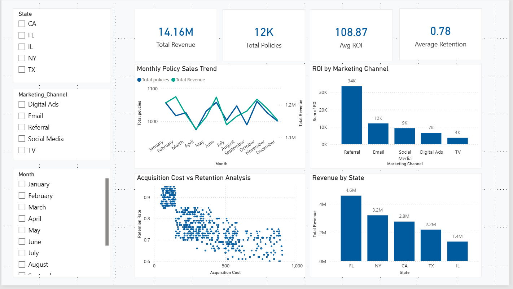

# 📊 Insurance Agency Performance Analysis

## Project Objective

The objective of this project is to analyze the performance of an insurance agency using a **simulated dataset** that represents realistic business operations.
The analysis focuses on understanding **sales trends**, **marketing efficiency**, and **customer retention**, and demonstrates how data analysis can support data-driven business decisions.

This project was created as a **portfolio project** to showcase skills in data analysis, SQL, and data visualization using tools commonly required in data analyst roles.

---

## Business Questions

This analysis aims to answer the following key questions:

* Which agents and states are the **top performers** in terms of policy sales and premium revenue?
* Which **marketing channels provide the highest return on investment (ROI)**?
* How do **policy sales and premium revenue evolve over time**?
* What is the relationship between **acquisition cost and customer retention**?
* Are higher acquisition costs associated with better retention outcomes?

---

## Dataset Overview

The dataset used in this project is **simulated** and was intentionally designed to mimic real insurance agency data.

**Columns included:**

* `Agent_ID` – Unique identifier for each insurance agent
* `State` – State where the agent operates
* `Policies_Sold` – Number of insurance policies sold
* `Premium_Amount` – Total premium revenue generated
* `Marketing_Channel` – Channel used to acquire customers
* `Acquisition_Cost` – Cost of acquiring customers
* `Retention_Rate` – Percentage of retained customers
* `Month` – Month of the transaction
* `ROI` – Return on investment (calculated metric)

Although the data is not real, it reflects realistic relationships between marketing spend, retention, and revenue.

---

## Tools Used

* **Python**

  * Data generation
  * Data cleaning and analysis
  * Exploratory Data Analysis (EDA)

* **Pandas & Matplotlib**

  * Aggregations
  * Feature engineering
  * Data visualization

* **SQL**

  * Performance analysis queries
  * Aggregations and ranking

* **Power BI**

  * Interactive dashboard
  * Business-focused data visualization

* **Excel**

  * Data inspection
  * Basic calculations and validation

---

## Key Insights

Some of the main findings from the analysis include:

* **Referral marketing** delivers the highest ROI and strongest retention rates, making it the most cost-efficient acquisition channel.
* **TV advertising** has the highest acquisition costs and lower ROI, indicating potential inefficiencies.
* **Digital Ads and Social Media** provide moderate ROI and are effective for scalable growth.
* **Policy sales remain relatively stable over time**, suggesting consistent demand.
* **California and Texas** generate the highest premium revenue, making them key markets.
* Higher acquisition costs **do not guarantee higher retention**, emphasizing the importance of channel efficiency.

---

## Dashboard Preview

The Power BI dashboard includes:

* 📈 Monthly policy sales trends
* 📊 ROI comparison by marketing channel
* 🗺️ Revenue comparison by state
* 🔵 Acquisition cost vs retention rate analysis

---

### 📷 Dashboard Overview

<p align="center">
  
</p>

---

### 📂 Power BI File

The interactive dashboard file is available here:

`/PowerBI/Insurance_Data.pbix`

> Download and open using Power BI Desktop to explore the full interactive version.

---

## How to Run the Project

### 1️⃣ Clone the repository

```bash
git clone https://github.com/yourusername/insurance-agency-performance.git
cd insurance-agency-performance
```

### 2️⃣ Install dependencies

```bash
pip install -r requirements.txt
```

### 3️⃣ Run the Jupyter Notebook

```bash
jupyter notebook
```

Open:

```
notebooks/insurance_analysis.ipynb
```

### 4️⃣ Use the data

* CSV files are available in the `/data` folder
* SQL queries are in the `/sql` folder
* Power BI dashboard file is in the `/dashboard` folder

---

## Notes

This project uses a **simulated dataset**, which is a common and accepted practice for portfolio projects. The primary goal is to demonstrate **analytical thinking, data handling, and communication skills**, rather than to analyze proprietary or real-world data.
